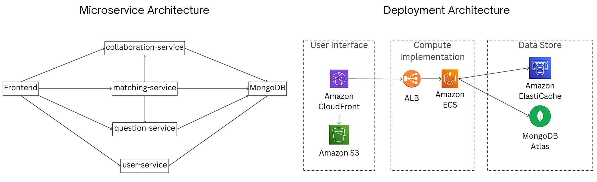

# CS3219 Project (PeerPrep) - AY2526S1
## Group: G08

## Table of Contents
1. [Overview](#overview)
2. [Architecture](#architecture)
3. [Tech Stack](#tech-stack)
4. [Installation](#installation)
5. [Running Locally](#running-locally)
6. [Environment Variables](#environment-variables)
7. [Deployment](#deployment)
8. [AI Usage](#ai-use-summary)

## Overview

PeerPrep is a microservices-based web application designed to help students prepare for technical interviews through peer matching, real-time code collaboration, and topic-tagged question practice.

This project was done by Group 08 - Xu Ziqi, Zhu Yicheng, Tan Zhi Heng, Swaminathan Viswa, Subramanian Karthikeyan

### Core Features/Services: 

- User-Service (M1): The User Service provides user authentication and user-profile management. Users can register using their Github account (which most developers would have). The service includes role-based access control with admin privileges for accessing the admin dashboard.

- Matching-Service (M2): The Matching Service implements a queue-based algorithm that pairs users based on selected difficulty level, coding language and topics. Users have the option of accepting/declining a match based on the user they have been paried with. Users who have been declined on will be auto-added to the queue back and matched again if possible. 

- Question-Service (M3): The Question Service provides a comprehensive database of technical interview questions organised by difficulty level (Easy, Medium, Hard) and topics (Array, String, Graph, etc.). Only users with admin privileges can add, edit and delete questions in the admin dashbboard.

- Collaboration-Service (M4): The Collaboration Service enables real-time code editing with automatic synchronisation across clients using `Socket.IO` for WebSocket connections and `Yjs` for conflict resolution. 

- User Interface: The frontend provides an intuitive React-based interface with Monaco Editor as the code editor in the collaborative session.

### Nice-to-have Features

- Enhanced code editor: The Monaco editor includes features like syntax highlighting, autocompletion with IntelliSense, code folding, and automatic indentation.
- Collaboration history: Users can view the question and final state of the code editor for past collaborative sessions.
- CI/CD with GitHub Actions
- Deployment on AWS

## Architecture

PeerPrep runs a React frontend (served via S3 + CloudFront) talking to an AWS Application Load Balancer, which routes to four Node.js microservices (user, matching, question, collaboration). MongoDB stores durable data (profiles, sessions, questions) and Redis powers the low-latency matching queue, while Socket.IO channels keep collaborators in sync.
## Tech-Stack 

### Frontend
- React + TypeScript
- MUI Component Library 
- Vite (bundler)

### Backend
- Node.js + Express (Core Framework)
- MongoDB (primary database)
- Redis (matchmaking queue handler)
- Yjs (CRDT for collaborative editing)

### DevOps & Deployment 
- Docker (service containerization)
- AWS ECS (Elastic Container Service) — microservice orchestration
- AWS ECR (container registry)
- AWS CloudFront (serves frontend globally)
- AWS S3 (static hosting for frontend)
- AWS CloudWatch (logs, metrics, dashboards)
- AWS Secrets Manager — credential storage
- GitHub Actions (CI/CD pipeline)

## Running Locally 

1. Initialise Docker containers: `docker compose up --build`
2. Change directory to web-server: `cd web-server`
3. Run front-end of web server: `npm run start`
4. Bring down containers: `docker compose down`

## Environment Configuration 
`.env.local` inside `user-service/` supplies GitHub OAuth credentials plus the JWT and MongoDB secrets needed for auth. `docker-compose.yml` wires the rest of the stack (MongoDB URIs per service, Redis URL, service ports, and frontend origins). Update these files—or override with ECS task definition secrets—before deploying to another environment.

## AI Use Summary

We used AI tooling only for simple tasks such as debugging small issues, writing boilerplate code, and polishing short documentation snippets. Architectural decisions, service boundaries, data models, and infrastructure setups were discussed and implemented manually by the team.
